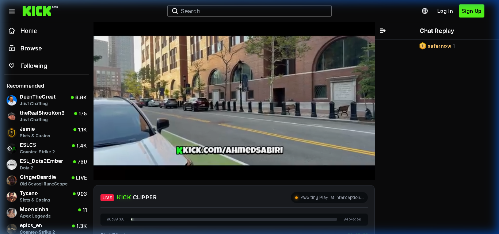
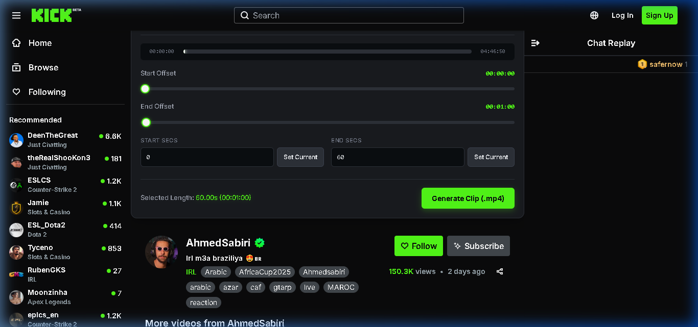
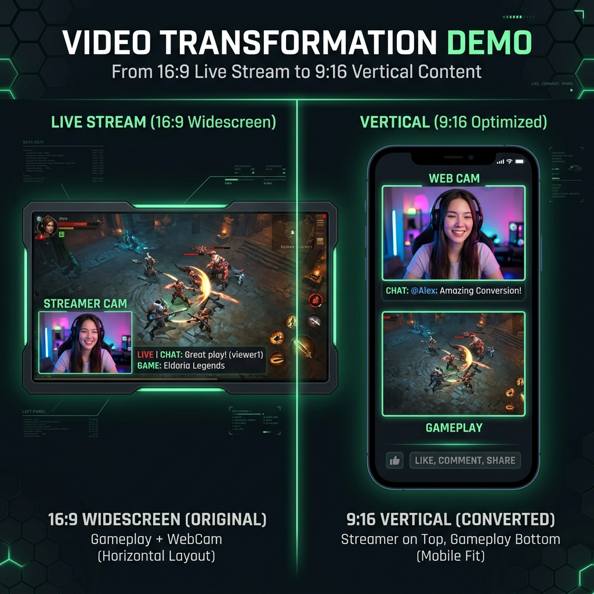

# Kick Stream Clipper (v2.0.0)

An ultimate, premium Chrome extension that intercepts Kick.com live stream/VOD playlist manifests, displays a high-performance visual clipping panel directly below the video player, and slices, transcodes, and archives HLS segments into widescreen (16:9) or vertical TikTok (9:16) formats using a local Python + FFmpeg server.





## Key Features

- **Double-Slider Trim Range Editor:** Visual timeline with real-time playhead tracking and video scrubbing preview coordinates.
- **TikTok Mode (9:16 Vertical Crop):** Overlays a visual neon green 9:16 bounding box on the stream player with semi-transparent dark blurred wings, allowing users to choose their crop frame with a horizontal slider.
- **Split-Screen Mode (9:16 Stacking):** Overlays an interactive, draggable, and resizable neon pink Facecam box on the player. The backend automatically clips both the gameplay and facecam regions, rescales them, and stacks them vertically for vertical social feeds.
- **Watermark Branding:** Burns custom social media handles/text watermarks on the top-left, top-right, or bottom-center of the clip.
- **Audio Booster:** Integrates an audio volume gain slider (0% to 300%) supporting clip muting or sound amplification.
- **Resolution Scaling:** Rescales the output clip height to 1080p, 720p, or 480p SD.
- **Fast-Path Stream Copying:** Detects unchanged widescreen formats and uses FFmpeg stream copying (`-c copy`) to compile clips **instantly (in <0.1s)** without re-encoding.
- **Local Gallery Library:** A built-in gallery dashboard inside the browser panel that lists generated clips, lets you replay videos natively, copy their network stream URLs, or delete them from local disk.
- **Mobile Compatibility:** Forces H.264 YUV 4:2:0 color spaces (`-pix_fmt yuv420p`) and moves index tables to the front (`-movflags +faststart`) to ensure clips play perfectly on iPhones and Android devices.

---

## Tech Stack & Architecture

- **Extension Frontend:** Manifest V3, Vanilla JavaScript, HTML5, Custom CSS (Neon Kick Theme).
- **Backend API:** Python 3 (standard `http.server`), subprocess FFmpeg pipeline.
- **Transcode Engine:** Local/PATH static FFmpeg binary.

### How it Works:
```
[ Kick.com Player ] <--- Injected GUI (content.js)
        |
        +---> [ background.js ] (Captures .m3u8 URLs & coordinates)
                   | (Standard HTTP GET Request)
                   v
          [ server.py ] (Downloads HLS .ts segments)
                   |
                   +---> Runs FFmpeg (Trims, Crops, Stacks, Watermarks)
                   |
                   +---> Saves to /clips/ directory
                   |
                   v (Returns MP4 download stream)
            [ Browser Downloads ]
```

---

## Getting Started

### 1. Backend Server Setup
The backend requires Python 3. The server automatically detects your local environment.

1. Open your terminal in the `kick-clipper-extension` folder.
2. Start the server:
   ```bash
   python server.py
   ```
   *Note: On first startup, if FFmpeg is not found in your system PATH, the server will print a notice. Simply place a static `ffmpeg.exe` file inside the `kick-clipper-extension` folder, and the server will automatically detect and run it.*

### 2. Extension Installation
1. Open Google Chrome or Brave and go to `chrome://extensions/`.
2. Toggle **Developer mode** (top-right corner) to **ON**.
3. Click the **Load unpacked** button (top-left corner).
4. Select the `kick-clipper-extension` folder.

### 3. Usage
1. Open any stream or VOD on Kick.com.
2. Select your trim range using the double-sliders below the video player.
3. Configure your format (Aspect Ratio, Watermark, Volume, Resolution).
4. Click **Generate Clip (.mp4)**.
5. Head to the **Local Gallery** tab to view, stream, or delete your generated clips!

---

## Project Structure

```text
kick-clipper-extension/
├── manifest.json       # Manifest V3 configurations
├── background.js       # Background worker (network interception & downloads)
├── content.js          # Content script (injects visual overlays & drag coordinates)
├── styles.css          # Injected stylesheet (dark theme and visual crop borders)
├── server.py           # Python HTTP API (downloads HLS segments & runs FFmpeg)
├── ffmpeg.exe          # Local FFmpeg binary (Windows fallback)
├── clips/              # Output folder containing generated MP4 clips
└── README.md           # Documentation
```

## License
MIT License.
